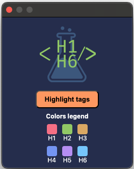
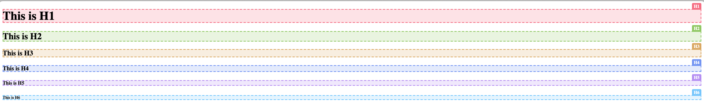

# Hierarchy H1-H6 Chrome Extension

An extension that displays the hierarchy of H1-H6 tags on any webpage, highlights them with customizable colors following the Tokyo Night theme, and provides additional features to enhance web development and SEO tasks.

## Features

- **Display Hierarchy**: Shows a structured list of all H1-H6 tags on the current webpage, including those within iframes.
- **Highlight Headings**: Visually highlights H1-H6 tags on the page with different colors corresponding to each heading level.
- **Tag Badges**: Adds badges displaying the tag names (e.g., H1, H2) on top of each heading for easy identification.
- **Color Legend**: Includes a color legend in the popup to indicate which color corresponds to each heading level.
- **Customization**: Allows users to customize colors for each heading level and save their preferences.
- **Keyboard Shortcuts**: Implements keyboard shortcuts to toggle the highlighting of tags without opening the popup.
- **Cross-Origin Iframe Handling**: Manages cross-origin iframe access limitations gracefully, ensuring the extension works securely and effectively.
- **User-Friendly Interface**: Provides a clean and intuitive popup interface for seamless interaction.

## Installation

1. **Clone or Download the Repository**: Download the extension files to your local machine.

2. **Open Chrome Extensions Page**:

   - Navigate to `chrome://extensions/` in your Chrome browser.
   - Enable **Developer mode** by toggling the switch in the top right corner.

3. **Load the Extension**:
   - Click on **Load unpacked**.
   - Select the folder containing the extension files.

The extension will now appear in your list of installed extensions.

## Usage

### Displaying the Hierarchy

1. **Navigate to a Webpage**: Open any webpage you wish to analyze.

2. **Open the Extension Popup**:
   - Click on the extension icon in the Chrome toolbar.
   - The popup will display a hierarchical list of all H1-H6 tags found on the page.

### Highlighting Headings

- **Using the Popup Button**:

  - In the extension popup, click the **"Highlight Tags"** button to toggle highlighting on or off.

- **Using Keyboard Shortcuts**:
  - Press `Alt+Shift+H` to toggle the highlighting of headings without opening the popup.

### Understanding the Color Legend

- The **Color Legend** in the popup shows which color corresponds to each heading level.
- This helps in quickly identifying headings on the page based on their color coding.

## Screenshots



_The extension popup displaying the hierarchy, color legend, and settings._


_Headings highlighted on a webpage with badges indicating their tag names._

## Keyboard Shortcuts

- **Open Extension Popup**: `Command+Shift+H` or `Ctrl+Shift+H`
- **Toggle Highlighting**: `Alt+Shift+H`

_Note: Keyboard shortcuts can be customized in Chrome's extension settings._

## Development

### Project Structure

- **manifest.json**: Configuration file defining the extension's properties, permissions, and scripts.
- **popup/index.html**: The HTML for the extension's popup interface.
- **popup/scripts/index.js**: Handles user interactions within the popup and communicates with content scripts.
- **scripts/content.js**: Injected into webpages to manipulate DOM elements and apply highlighting.
- **scripts/background.js**: Manages background tasks, keyboard shortcuts, and message passing.
- **icons/**: Contains the extension icon images.
- **images/**: Contains screenshots and images for the README.

### Building from Source

1. **Clone the Repository**:

   ```bash
   git clone git@github.com:MatheusDubberstein/h1-h6-tag-tester.git
   ```

2. Navigate to the Extension Directory:

   ```bash
   cd h1-h6-tag-tester
   ```

3. Load the Extension in Chrome:
   • Follow the installation steps mentioned above.

## Permissions

The extension requests the following permissions:

    - **activeTab**: To interact with the currently active tab.
    - **scripting**: To execute scripts in the context of web pages.
    - **storage**: To save user preferences for custom colors.
    - **webNavigation**: To access information about the frames within a tab.
    - **host_permissions**: <all_urls> to allow the extension to work on all websites.

_Note: The extension respects user privacy and only accesses necessary data to provide its functionality._

## Troubleshooting

### Headings Not Highlighted:

- Ensure that you have reloaded the webpage after installing the extension.
- Check if the page is a Chrome internal page (chrome://), as extensions cannot run on these pages.

### Badge Positioning Issues:

- Some webpages with custom styles may affect badge positioning.
- The extension tries to adjust for most cases, but perfect compatibility cannot be guaranteed.

### Cross-Origin Iframes:

- Due to browser security policies, the extension may not access headings within cross-origin iframes.
- The extension handles this gracefully by processing accessible iframes and informing the user when content cannot be accessed.

## Contribution

Contributions are welcome! If you have ideas for improvements or encounter issues:

1. Fork the Repository
2. Create a Feature Branch

```bash
git checkout -b feature/AmazingFeature
```

3. Commit your Changes

```bash
git commit -m 'Add some AmazingFeature'
```

4. Push to the Branch

```bash
git push origin feature/AmazingFeature
```

5. Open a Pull Request.

## License

this project is licensed under the MIT License - see the [LICENSE](LICENSE) file for details.

## Acknowledgements

- **Tokyo Night Theme**: The color scheme is inspired by the popular Tokyo Night theme.

## Contact

For questions or support, please open an issue on the [GitHub repository](https://github.com/MatheusDubberstein/h1-h6-tag-tester/issues) or contact the maintainer at matheusdub.s@gmail.com.

Happy coding and web developing with the Hierarchy H1-H6 Chrome Extension!
